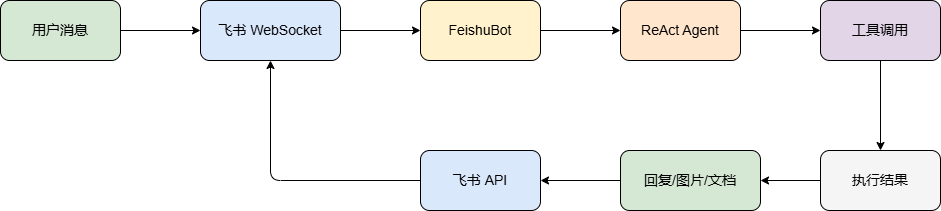
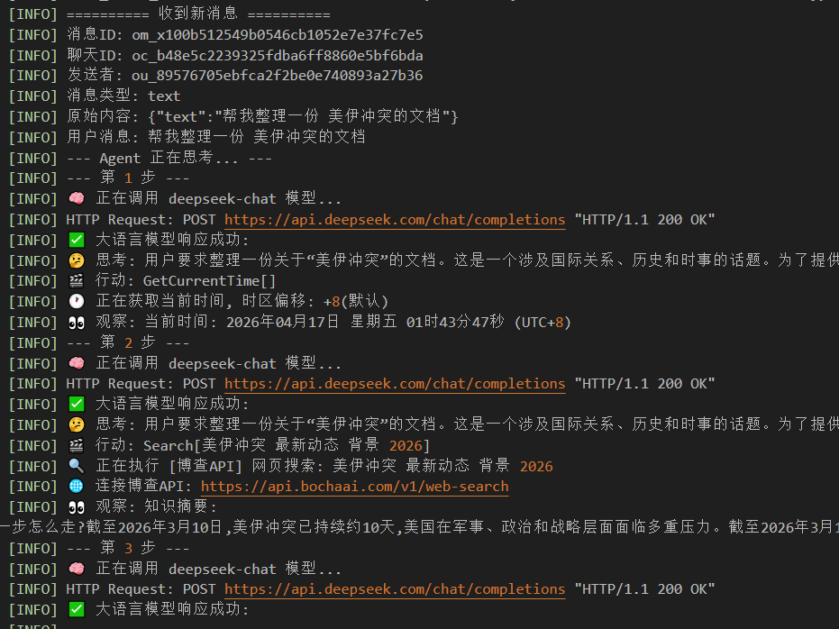
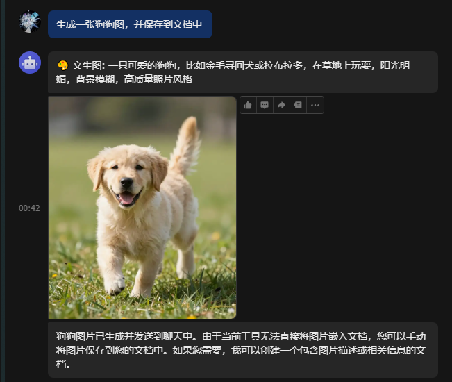
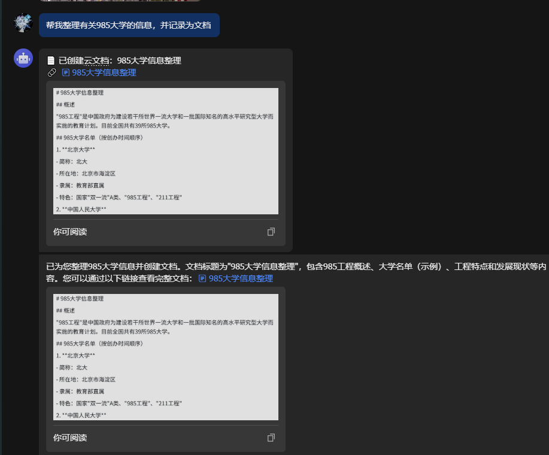

# 飞书 Agent 机器人

基于 ReAct Agent 的飞书智能助手，集成大语言模型、ComfyUI 图像生成/编辑和飞书云文档功能。

## 功能概览


| 能力 | 说明 |
|------|------|
| 💬 智能问答 | 基于大语言模型（DeepSeek）的 ReAct Agent，支持多步推理和工具调用 |
| 🔍 网页搜索 | 通过博查 API 搜索实时信息（时事、新闻等） |
| 🎨 文生图 | 基于 ComfyUI 的文字生成图片 |
| 🖌️ 图像编辑 | 上传图片后通过自然语言描述进行编辑（换背景、加配饰等） |
| 📄 创建文档 | 一键创建飞书云文档，自动转移所有者给用户 |
| ✏️ 写入文档 | 向已有飞书云文档追加内容 |
| 🧮 数学计算 | 安全计算器，支持四则运算和指数 |
| 🕐 时间查询 | 获取当前日期时间 |

---

## 架构




### 文件结构

```
ComfyScript/
├── main.py              # 主入口，FeishuBot 类（消息去重、解析、分发）
├── Agent.py             # ReAct Agent + 工具定义（搜索、文生图、文档等）
├── Comfyui.py           # ComfyUI 客户端（工作流执行、图像处理）
├── feishu_client.py     # 飞书 API 封装（消息、图片、文档）
├── config.json5         # ComfyUI 工作流配置
├── .env                 # 环境变量（API Key、飞书凭据）
├── workflows/           # ComfyUI 工作流 JSON
├── start_comfyui.py     # ComfyUI + Ngrok 启动脚本
├── start_comfyui_local.py  # ComfyUI 本地启动脚本（无内网穿透）
└── logs/                # 运行日志
```

---

## 功能详情

### 1. 智能问答与多步推理

Agent 采用 ReAct（Reasoning + Acting）模式，能够：

- 分析用户意图，规划多步操作
- 调用合适的工具获取信息
- 基于工具返回结果综合回答



**示例对话：**

> 用户：最近有什么科技新闻？  
> Agent：[调用 Search 工具] → 基于搜索结果总结回答

> 用户：帮我算一下 (123 + 456) * 789 / 12  
> Agent：[调用 Calculator 工具] → 返回计算结果

### 2. 文生图



用户发送文字描述，Agent 调用 ComfyUI 生成图片并自动发送到聊天。

**示例：**

> 用户：画一只在雪地里玩耍的猫咪  
> Agent：[调用 TextToImage 工具] → 生成并发送图片

支持的工作流由 `config.json5` 中的 `text_to_image` 配置，默认使用 `Z-image.json`。

### 3. 图像编辑


用户先发送一张图片，然后输入编辑指令：

1. 用户发送图片 → 机器人提示"是否需要编辑？"
2. 用户输入编辑描述（如"把背景换成海滩"）
3. Agent 调用 EditImage 工具执行编辑
4. 编辑后的图片自动发送到聊天

**取消编辑：** 回复"不需要"、"不用"等即可取消。


### 4. 飞书云文档



**创建文档：**

> 用户：帮我创建一个会议纪要文档  
> Agent：[调用 CreateDoc 工具] → 创建文档并将所有者转移给用户，返回链接

**写入文档：**

> 用户：往文档 https://xxx/docx/abc 里添加"今日待办：完成报告"  
> Agent：[调用 WriteDoc 工具] → 追加内容到文档

> 用户：帮我搜索AI发展趋势，然后整理成文档  
> Agent：[调用 Search] → [调用 CreateDoc] → 一条龙完成

**所有者转移：** 创建的文档会自动将所有者从机器人转移给用户，确保用户拥有完整编辑权限。

### 5. ComfyUI 服务器自动连接

启动时自动检测 ComfyUI 服务器：

1. 先尝试内网地址 `http://127.0.0.1:8188`
2. 如果内网不通，通过 ngrok API 获取公网地址
3. 切换到公网地址连接

运行时检查服务器也会自动回退到公网地址。

---

## 快速开始

### 环境要求

- Python 3.10+
- ComfyUI（含工作流模型）
- [可选] ngrok（内网穿透）

### 1. 配置环境变量

复制 `.env` 文件并填写：

```env
# 大语言模型（DeepSeek）
LLM_API_KEY="your-deepseek-api-key"
LLM_MODEL_ID="deepseek-chat"
LLM_BASE_URL="https://api.deepseek.com"

# 博查搜索 API
BOC_SEARCH_API_URL="https://api.bochaai.com/v1/web-search"
BOC_SEARCH_API_KEY="your-bocha-api-key"

# 飞书应用
FEISHU_APP_ID="your-app-id"
FEISHU_APP_SECRET="your-app-secret"
```

### 2. 配置 ComfyUI

编辑 `config.json5`，修改 ComfyUI 路径和工作流：

```json5
{
    "comfyUI": {
        "folder": "D:\\path\\to\\ComfyUI",
        "python_exe": "D:\\path\\to\\ComfyUI\\python\\python.exe",
        "main_py": "D:\\path\\to\\ComfyUI\\main.py",
        "host": "127.0.0.1",
        "port": "8188"
    }
}
```

### 3. 安装依赖

```bash
pip install lark-oapi openai python-dotenv requests
```

### 4. 启动 ComfyUI 服务器

**方式一：本地启动（无内网穿透）**

```bash
python start_comfyui_local.py
```

**方式二：带内网穿透启动**

```bash
python start_comfyui.py
```

需要先安装 ngrok 并配置 `start_comfyui.py` 中的路径。


### 5. 启动机器人

```bash
python main.py
```


### 6. 飞书应用配置

在[飞书开放平台](https://open.feishu.cn/)创建应用：

1. 创建企业自建应用
2. 开启机器人能力
3. 添加权限：`im:message`、`im:message:send_as_bot`、`im:resource`、`drive:drive`、`docx:document`
4. 订阅事件：`im.message.receive_v1`
5. 发布应用

- 快速导入权限
```
{
  "scopes": {
    "tenant": [
      "aily:message:read",
      "aily:message:write",
      "bitable:app",
      "bitable:app:readonly",
      "docs:doc",
      "docs:doc:readonly",
      "docs:document.comment:create",
      "docs:document.comment:delete",
      "docs:document.comment:read",
      "docs:document.comment:update",
      "docs:document.comment:write_only",
      "docs:document.content:read",
      "docs:document.media:download",
      "docs:document.media:upload",
      "docs:document.subscription",
      "docs:document.subscription:read",
      "docs:document:copy",
      "docs:document:export",
      "docs:document:import",
      "docs:event.document_deleted:read",
      "docs:event.document_edited:read",
      "docs:event.document_opened:read",
      "docs:event:subscribe",
      "docs:permission.member",
      "docs:permission.member:auth",
      "docs:permission.member:create",
      "docs:permission.member:delete",
      "docs:permission.member:readonly",
      "docs:permission.member:retrieve",
      "docs:permission.member:transfer",
      "docs:permission.member:update",
      "docs:permission.setting",
      "docs:permission.setting:read",
      "docs:permission.setting:readonly",
      "docs:permission.setting:write_only",
      "docx:document",
      "docx:document.block:convert",
      "docx:document:create",
      "docx:document:readonly",
      "docx:document:write_only",
      "drive:drive",
      "drive:drive.metadata:readonly",
      "drive:drive.search:readonly",
      "drive:drive:readonly",
      "drive:drive:version",
      "drive:drive:version:readonly",
      "drive:export:readonly",
      "drive:file",
      "drive:file.like:readonly",
      "drive:file.meta.sec_label.read_only",
      "drive:file:download",
      "drive:file:readonly",
      "drive:file:upload",
      "drive:file:view_record:readonly",
      "im:app_feed_card:write",
      "im:biz_entity_tag_relation:read",
      "im:biz_entity_tag_relation:write",
      "im:chat",
      "im:message",
      "im:message.group_at_msg:readonly",
      "im:message.p2p_msg:readonly",
      "im:message:send_as_bot",
      "im:resource",
      "sheets:spreadsheet"
    ],
    "user": [
      "aily:message:read",
      "aily:message:write",
      "base:app:copy",
      "base:app:create",
      "base:app:read",
      "base:app:update",
      "base:collaborator:create",
      "base:collaborator:delete",
      "base:collaborator:read",
      "base:dashboard:copy",
      "base:dashboard:create",
      "base:dashboard:delete",
      "base:dashboard:read",
      "base:dashboard:update",
      "base:field:create",
      "base:field:delete",
      "base:field:read",
      "base:field:update",
      "base:field_group:create",
      "base:form:create",
      "base:form:delete",
      "base:form:read",
      "base:form:update",
      "base:history:read",
      "base:record:create",
      "base:record:delete",
      "base:record:read",
      "base:record:retrieve",
      "base:record:update",
      "base:role:create",
      "base:role:delete",
      "base:role:read",
      "base:role:update",
      "base:table:create",
      "base:table:delete",
      "base:table:read",
      "base:table:update",
      "base:view:read",
      "base:view:write_only",
      "base:workflow:create",
      "base:workflow:delete",
      "base:workflow:read",
      "base:workflow:update",
      "base:workflow:write",
      "base:workspace:list",
      "bitable:app",
      "bitable:app:readonly",
      "board:whiteboard:node:create",
      "board:whiteboard:node:delete",
      "board:whiteboard:node:read",
      "board:whiteboard:node:update",
      "docs:doc",
      "docs:doc:readonly",
      "docs:document.comment:create",
      "docs:document.comment:delete",
      "docs:document.comment:read",
      "docs:document.comment:update",
      "docs:document.comment:write_only",
      "docs:document.content:read",
      "docs:document.media:download",
      "docs:document.media:upload",
      "docs:document.subscription",
      "docs:document.subscription:read",
      "docs:document:copy",
      "docs:document:export",
      "docs:document:import",
      "docs:event.document_deleted:read",
      "docs:event.document_edited:read",
      "docs:event.document_opened:read",
      "docs:event:subscribe",
      "docs:permission.member",
      "docs:permission.member:auth",
      "docs:permission.member:create",
      "docs:permission.member:delete",
      "docs:permission.member:readonly",
      "docs:permission.member:retrieve",
      "docs:permission.member:transfer",
      "docs:permission.member:update",
      "docs:permission.setting",
      "docs:permission.setting:read",
      "docs:permission.setting:readonly",
      "docs:permission.setting:write_only",
      "docx:document",
      "docx:document.block:convert",
      "docx:document:create",
      "docx:document:readonly",
      "docx:document:write_only",
      "drive:drive",
      "drive:drive.metadata:readonly",
      "drive:drive.search:readonly",
      "drive:drive:readonly",
      "drive:drive:version",
      "drive:drive:version:readonly",
      "drive:export:readonly",
      "drive:file",
      "drive:file.like:readonly",
      "drive:file.meta.sec_label.read_only",
      "drive:file:download",
      "drive:file:readonly",
      "drive:file:upload",
      "drive:file:view_record:readonly",
      "sheets:spreadsheet",
      "sheets:spreadsheet.meta:read",
      "sheets:spreadsheet.meta:write_only",
      "sheets:spreadsheet:create",
      "sheets:spreadsheet:read",
      "sheets:spreadsheet:readonly",
      "sheets:spreadsheet:write_only",
      "slides:presentation:create",
      "slides:presentation:read",
      "slides:presentation:update",
      "slides:presentation:write_only",
      "space:document.event:read",
      "space:document:delete",
      "space:document:move",
      "space:document:retrieve",
      "space:document:shortcut",
      "space:folder:create",
      "wiki:member:create",
      "wiki:member:retrieve",
      "wiki:member:update",
      "wiki:node:copy",
      "wiki:node:create",
      "wiki:node:move",
      "wiki:node:read",
      "wiki:node:retrieve",
      "wiki:node:update",
      "wiki:setting:read",
      "wiki:setting:write_only",
      "wiki:space:read",
      "wiki:space:retrieve",
      "wiki:space:write_only",
      "wiki:wiki",
      "wiki:wiki:readonly"
    ]
  }
}
```

---


## 技术细节

### ReAct Agent

使用 Zero-Shot ReAct 模式，Agent 每一步执行：

1. **Thought**：分析当前情况，决定下一步行动
2. **Action**：调用工具或 Finish
3. **Observation**：获取工具执行结果

最多执行 8 步，连续失败 3 次自动终止。

### 消息去重

`MessageDeduplicator` 类防止同一消息被并发处理或重复处理：

- `_processing`：正在处理的消息 ID 集合
- `_processed`：已处理的消息 ID 集合（自动清理，上限 1000）

### 文档所有者转移

创建文档后自动执行：

1. 用 `tenant_access_token` 创建文档（所有者为机器人应用）
2. 将用户添加为文档协作者（`full_access` 权限）
3. 调用转移所有者 API，将所有者转移给用户

### 长消息分段

飞书单条消息有长度限制，超过 4000 字符会自动分段发送。
